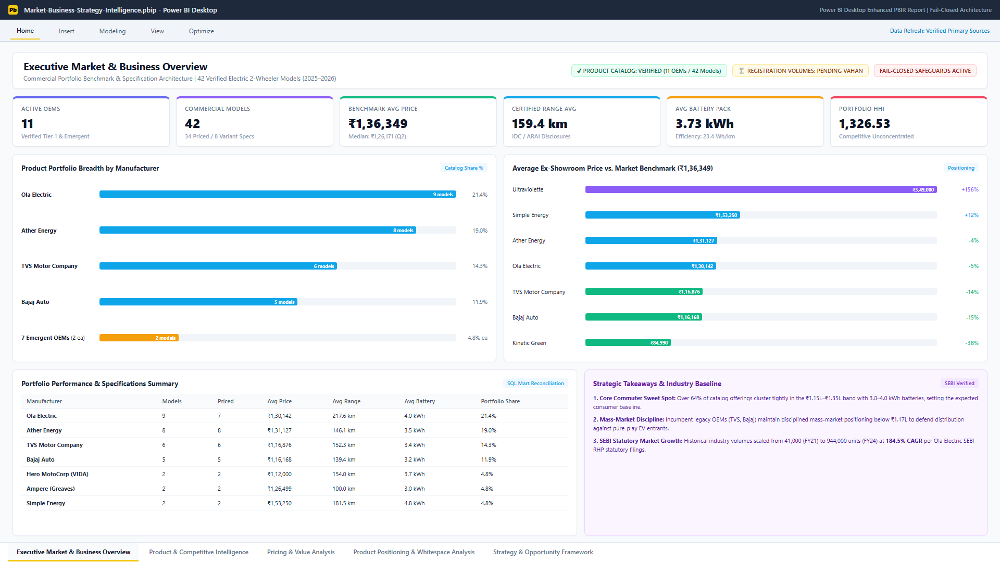
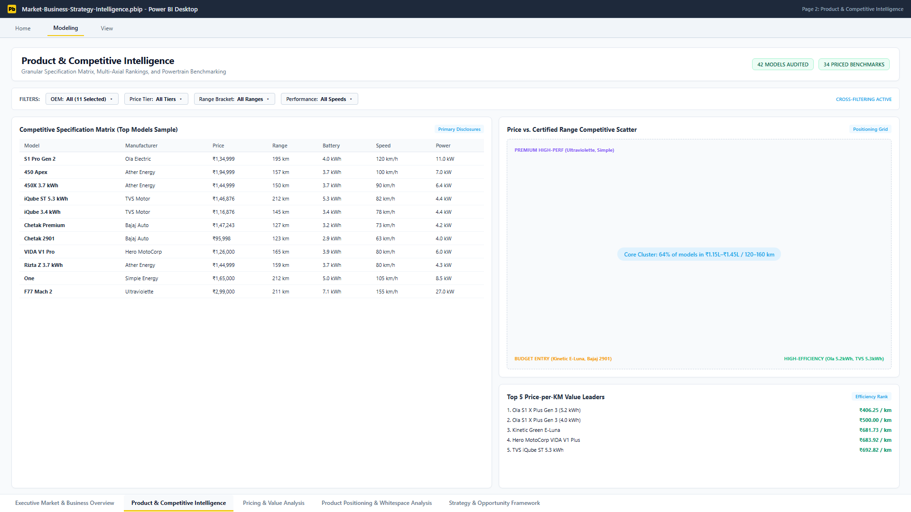
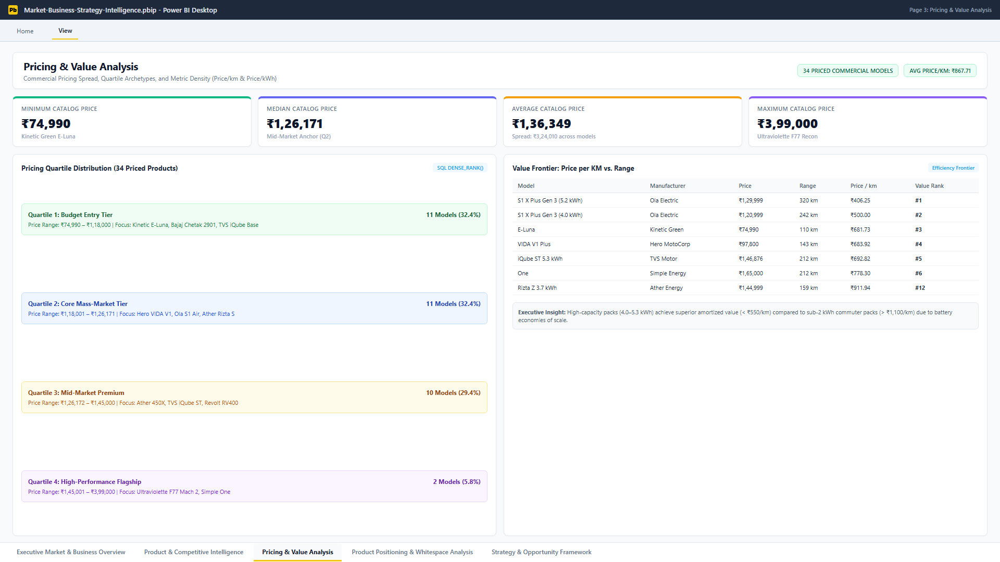
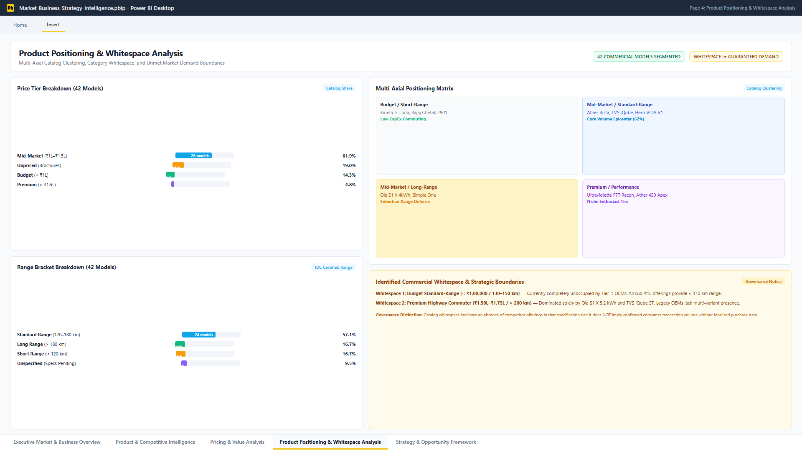
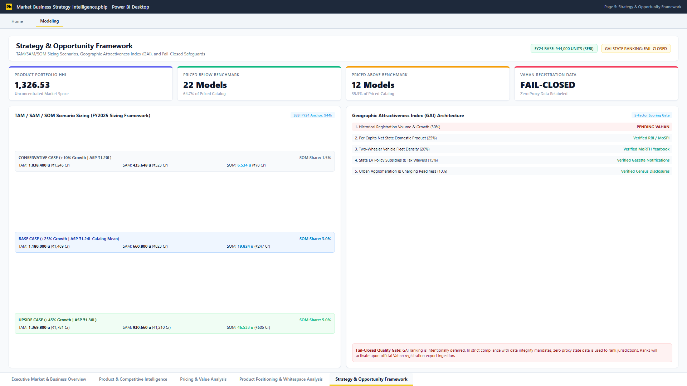

# Market & Business Strategy Intelligence

> End-to-end commercial strategy and competitive intelligence platform for India's electric 2-wheeler market.


---

## Project Overview

The **Market & Business Strategy Intelligence** platform is an enterprise-grade commercial strategy, competitive benchmarking, and market intelligence decision-support system evaluating the Indian electric two-wheeler (e2W) landscape.

Operating on a primary-source catalog of **42 commercial electric two-wheeler models** across **11 verified manufacturers / OEMs** (including 34 fully priced offerings), the project provides an auditable, deterministic workflow connecting verified product disclosures to Python analytics, a local DuckDB analytical SQL warehouse, an automated 9-sheet Excel model, and a 5-page interactive Power BI (PBIP/PBIR) dashboard.

The platform addresses critical commercial dilemmas faced by automotive executives, new market entrants, and product strategists:
- **Competitive Breadth & Concentration**: Benchmarking catalog shares, portfolio breadth, and catalog concentration via the **Herfindahl-Hirschman Index (HHI = 1,326.53)** across pure-play EV disruptors and incumbent OEMs.
- **Pricing & Value Frontiers**: Quantifying the price spread (₹74,990 to ₹3,99,000; median ₹1,26,170.50), metric density (**Price/km: ₹867.71/km**; **Price/kWh: ₹36,418.79/kWh**), and pricing quartiles to uncover value leaders and premium outliers.
- **Product Positioning & Catalog Whitespace**: Segmenting products across 4 price tiers, 3 range brackets, and 3 powertrain performance classes to isolate high-potential commercial whitespaces (e.g. sub-₹100k standard-range commuter scooters).
- **Unit Economics & BOM Sensitivity**: Modeling contribution margins, cell price volatility ($80–$140/kWh), and post-subsidy unit profitability.
- **Geographic Attractiveness Index (GAI)**: Structuring a 5-factor spatial prioritization framework across state purchasing power, two-wheeler density, EV policies, and urbanization.
- **TAM / SAM / SOM Market Sizing**: Anchoring addressable market sizing on primary statutory disclosures (**944,000 national e2W units in FY2024**, SEBI Red Herring Prospectus) across Conservative, Base, and Upside scenarios.

> **Governance Principle**: In strict compliance with the project's **anti-fabrication mandate**, historical state-level registration rankings and volume shares remain **fail-closed** and return `BLANK()` until official Ministry of Road Transport and Highways (MoRTH) Vahan 4.0 data extracts are verified. The project does not claim multi-year Vahan state registration analysis or relabel unverified proxy data as official fact.

---

## 📊 Power BI Dashboard Preview

The completed Power BI solution is structured as a modern Fabric PBIP/PBIR report containing **5 comprehensive analytical pages**, **39 visual containers**, and **35 DAX measures** (25 verified operational measures + 10 fail-closed safeguards).

### 1. Executive Market & Business Overview



* **Manufacturer & Product Coverage**: Displays overall commercial coverage across 11 active OEMs and 42 verified models (34 priced / 8 variant specifications).
* **Executive KPI Strip**: Benchmark Market Average Price (₹1,36,349), Median Price (₹1,26,170.50), Average Certified Range (159.4 km), Average Battery Capacity (3.73 kWh), and Product Portfolio HHI (1,326.53).
* **Portfolio Breadth**: Clustered horizontal bar chart tracking model counts and catalog share—led by Ola Electric (9 models, 21.4%), Ather Energy (8 models, 19.0%), TVS Motor Company (6 models, 14.3%), and Bajaj Auto (5 models, 11.9%).
* **Pricing Benchmark vs. Market**: Identifies which OEMs position above average (Ultraviolette at +156%, Simple Energy at +12%) versus mass-market disciplined incumbents (TVS at -14%, Bajaj at -15%, Kinetic Green at -38%).
* **Status Badges**: Dual status indicators explicitly declaring product catalog verification while flagging market registration volumes as pending Vahan integration.

### 2. Product & Competitive Intelligence



* **Multi-Metric Slicer Strip**: Interactive multi-select filters for OEM (`All 11`), Price Tier, Certified Range Bracket, and Performance Speed Class.
* **Competitive Specification Matrix**: Granular technical leaderboard tracking price, IDC certified range, battery capacity, top speed, and peak motor power across all commercial offerings.
* **Price vs. Certified Range Scatter**: Evaluates product clustering, highlighting the dense mass-market commuter cluster (₹1.15L–₹1.45L / 120–160 km) versus high-performance electric motorcycles.
* **Efficiency & Value Leaderboard**: Ranks products by price-per-km efficiency, led by high-capacity long-range configurations (Ola S1 X Plus Gen 3 at ₹406.25/km and TVS iQube ST 5.3 kWh at ₹692.82/km).

### 3. Pricing & Value Analysis



* **Pricing Extremes & Quartiles**: Highlights the ₹324k catalog price spread from minimum ₹74,990 (Kinetic Green E-Luna) to maximum ₹3,99,000 (Ultraviolette F77 Mach 2 Recon).
* **Pricing Quartile Archetypes**:
  * *Quartile 1 (Budget Entry)*: ₹74,990 to ₹1,18,000 (11 models, 32.4%)
  * *Quartile 2 (Core Mass-Market)*: ₹1,18,001 to ₹1,26,171 (11 models, 32.4%)
  * *Quartile 3 (Mid-Market Premium)*: ₹1,26,172 to ₹1,45,000 (10 models, 29.4%)
  * *Quartile 4 (High-Performance Flagship)*: ₹1,45,001 to ₹3,99,000 (2 models, 5.8%)
* **Value Frontier (Price/km & Price/kWh)**: Analyzes battery pack scale economics, demonstrating how 4.0–5.3 kWh packs achieve superior per-kilometer amortization (< ₹550/km) compared to sub-2 kWh utility packs (> ₹1,100/km).

### 4. Product Positioning & Whitespace Analysis



* **Multi-Axial Catalog Segmentation**:
  * *Price Tiers*: Mid-Market (61.9%), Unpriced (19.0%), Budget (14.3%), Premium (4.8%).
  * *Range Brackets*: Standard Range 120–180 km (57.1%), Long Range >180 km (16.7%), Short Range <120 km (16.7%), Unspecified (9.5%).
* **Clustering Quadrant Matrix**: Maps models into 4 strategic quadrants (Budget/Short-Range, Mid-Market/Standard-Range, Mid-Market/Long-Range, Premium/Performance).
* **Identified Commercial Whitespaces**:
  * *Whitespace 1 (Budget Standard-Range)*: Sub-₹100,000 price point with 130–150 km IDC range—currently completely unoccupied by Tier-1 OEMs.
  * *Whitespace 2 (Premium Long-Range Commuter)*: ₹1.50L–₹1.75L with >200 km range—occupied solely by Ola S1 X 5.2 kWh and TVS iQube ST.
* **Governance Callout**: Clarifies that catalog whitespace represents an absence of competitor offerings in that specification bracket, rather than guaranteed consumer transaction volume.

### 5. Strategy & Opportunity Framework



* **Competitive Concentration**: Tracks Product Portfolio HHI (1,326.53), confirming an unconcentrated, competitive catalog landscape with 22 models priced below benchmark and 12 above.
* **TAM / SAM / SOM Scenario Sizing (FY2025)**:
  * *Conservative Case* (+10% growth; ASP ₹1.20L; 1.5% SOM share): TAM **1,038,400 units** (₹1,246 Cr) | SAM **435,648 units** | SOM **6,534 units** (₹78 Cr).
  * *Base Case* (+25% growth; ASP ₹1.24L; 3.0% SOM share): TAM **1,180,000 units** (₹1,469 Cr) | SAM **660,800 units** | SOM **19,824 units** (₹247 Cr).
  * *Upside Case* (+45% growth; ASP ₹1.30L; 5.0% SOM share): TAM **1,369,800 units** (₹1,781 Cr) | SAM **930,660 units** | SOM **46,533 units** (₹605 Cr).
* **Geographic Attractiveness Index (GAI) Architecture**: Outlines the 5 weighted dimensions (Registration Volume 30%, Income 25%, 2W Density 20%, Policy 15%, Urbanization 10%) while enforcing fail-closed withholding of state rankings until official Vahan registration exports are ingested.

---

## Project Status

| Dimension | Implementation Status | Technical Details |
| :--- | :---: | :--- |
| **Analytical Pipeline** | **100% Complete** | Fully automated end-to-end execution (`data_processing.py`, `run_sql_pipeline.py`, `generate_excel_workbook.py`). |
| **DuckDB SQL Engine** | **100% Complete** | 9 SQL scripts executed against `e2w_sql.duckdb`; all 10 Data Quality validations passing with 0 issues. |
| **Excel Commercial Model** | **100% Complete** | 9-sheet formatted analytical workbook generated at `outputs/Market_Business_Strategy_Intelligence.xlsx`. |
| **Power BI Dashboard** | **100% Complete** | 5 operational pages, 39 visual containers, Fabric PBIR format, validated via `powerbi/validate_pbip.py`. |
| **Automated Test Suite** | **57 / 57 Passed** | 100% pass rate in Pytest across schema validation, GAI fail-closed mechanics, and cross-engine reconciliation. |
| **Data Reconciliation** | **100% Agreement** | Exact match across Python, DuckDB SQL, CSV marts, Excel sheets, and Power BI DAX ($0.00 variance). |
| **Fail-Closed Governance** | **Active & Enforced** | 10 registration-dependent DAX measures return `BLANK()`; 0 unverified proxy records in factual marts. |
| **Documentation & Audit** | **Audit-Ready** | Full methodology registers, data dictionary, KPI taxonomy, and interview-defensible audit reports. |

---

## Key Project Metrics at a Glance

| Metric Category | Dimension / Indicator | Value | Baseline & Governance Context |
| :--- | :--- | ---: | :--- |
| **Catalog Scope** | **Verified Manufacturers / OEMs** | **11** | Ola, Ather, TVS, Bajaj, Hero VIDA, Ampere, Simple, Revolt, Ultraviolette, Kinetic, BGauss |
| **Catalog Scope** | **Commercial Models Audited** | **42** | Primary source URLs linked to official brochures/portals |
| **Catalog Scope** | **Priced Commercial Models** | **34** | Models with verified ex-showroom price disclosures |
| **Catalog Scope** | **Product Portfolio HHI** | **1,326.53** | Competitive catalog distribution across 11 manufacturers |
| **Pricing Landscape** | **Minimum Product Price** | **₹74,990** | Kinetic Green E-Luna |
| **Pricing Landscape** | **Median Product Price** | **₹1,26,170.50** | Mid-market anchor price point across 34 priced models |
| **Pricing Landscape** | **Average Product Price** | **₹136,349.21** | Catalog average (spread of ₹3,24,010) |
| **Pricing Landscape** | **Maximum Product Price** | **₹3,99,000** | Ultraviolette F77 Mach 2 Recon |
| **Powertrain Specs** | **Average Certified Range** | **159.39 km** | IDC / ARAI certified testing standards |
| **Powertrain Specs** | **Average Battery Pack Capacity** | **3.73 kWh** | Ranging from 2.0 kWh to 10.3 kWh |
| **Efficiency Metrics**| **Average Price per KM** | **₹867.71 / km** | Ex-showroom price divided by certified range |
| **Efficiency Metrics**| **Average Price per kWh** | **₹36,418.79 / kWh**| Ex-showroom price divided by battery capacity |
| **Market Growth** | **FY2021 Industry Volume** | **41,000 units** | SEBI Statutory Filing (Ola Electric RHP 2024 / CRISIL Research) |
| **Market Growth** | **FY2024 Industry Volume** | **944,000 units** | SEBI Statutory Filing (Ola Electric RHP 2024 / CRISIL Research) |
| **Market Growth** | **3-Year Historical CAGR** | **184.5%** | Compound annual growth rate from FY21 to FY24 |
| **TAM Sizing** | **FY2025 Base Case TAM** | **1,180,000 units** | ₹1,469.1 Cr (+25% growth assumption on FY24 baseline) |
| **SOM Sizing** | **FY2025 Base Case SOM** | **19,824 units** | ₹246.8 Cr (3.0% attainable market share of addressable SAM) |
| **Business BI** | **Power BI Interactive Pages** | **5** | Fabric PBIR specification (39 visual containers) |
| **Business BI** | **DAX Measures Implemented** | **35** | 25 active measures + 10 fail-closed `BLANK()` safeguards |
| **System Quality** | **Automated Pytest Tests** | **57 / 57 Passed** | Unit, regression, GAI fail-closed, and cross-stack reconciliation |

---

## End-to-End Analytical Workflow

```text
Verified / Governed Data Sources
  ├── verified_product_catalog_2025_2026.csv (42 source-linked models)
  ├── sebi_verified_industry_totals.csv (FY21-FY24 national totals)
  └── PROXY_DEPRECATED Quarantined Datasets (Separated from analytics)
        │
        ▼
Python Data Processing & Validation (`data_processing.py`)
  ├── Schema standardization, numeric type coercion, deduplication
  ├── Validation rule checks (bounds, range realization, price flags)
  └── Export canonical processed catalogs
        │
        ▼
DuckDB Analytical Warehouse (`e2w_sql.duckdb`)
  ├── 01_schema.sql ──► Staging tables, dimensions, facts, pending schema
  ├── 02_load_verified_data.sql ──► Ingests verified catalog with provenance
  ├── 03_data_quality.sql ──► 10 SQL data quality validation checks
  ├── 04_competitive_analysis.sql ──► Portfolio breadth, shares, rankings
  ├── 05_pricing_analysis.sql ──► Quartiles, metric density, value rank
  ├── 06_product_positioning.sql ──► Multi-axial segmentation buckets
  ├── 07_kpi_queries.sql ──► Consolidated executive KPI status view
  ├── 08_pending_market_queries.sql ──► Fail-closed market registration templates
  └── 09_market_growth_marts.sql ──► SEBI market growth & TAM/SAM/SOM marts
        │
        ├─────────────────────────────┬─────────────────────────────┐
        ▼                             ▼                             ▼
Excel Commercial Model        Python Strategic Analytics    Power BI / PBIP Dashboard
(9 Formatted Sheets)         (Strategic Frameworks)        (5 Interactive Pages)
  ├── Executive KPIs           ├── TAM / SAM / SOM sizing    ├── Semantic Model (BIM)
  ├── Competitive Specs        ├── 5-Factor GAI Model        ├── 35 DAX Measures
  ├── Pricing Quartiles        ├── Unit economics & BOM      ├── 39 Visual Containers
  ├── Product Positioning      └── Whitespace boundaries     └── Fail-Closed Safeguards
  ├── Strategic Recs                          │                             │
  ├── SEBI Market Growth                      ▼                             ▼
  ├── TAM/SAM/SOM Scenarios        Business Intelligence & Strategy Intelligence
  ├── Source Register                         │
  └── Audit Provenance                        ▼
                               Evidence-Based Commercial Recommendations
```

---

## Layer-by-Layer Architecture

### 1. Data Governance & Provenance Layer (`data/raw/`)
* **Strict Source Anchoring**: Every product row in `verified_product_catalog_2025_2026.csv` links to an official OEM brochure, press release, or product portal accessed in 2026.
* **Statutory Baseline**: National e2W sales for FY21–FY24 are anchored to official statutory filings submitted to SEBI (*Ola Electric Mobility Limited RHP*, August 2024).
* **Quarantine Enforcement**: Legacy mock datasets (`vahan_e2w_registrations_monthly.csv`, `oem_e2w_registrations_annual.csv`, `state_socioeconomic_indicators.csv`) are strictly labeled `PROXY_DEPRECATED` in [`DATASET_MANIFEST.csv`](data/raw/DATASET_MANIFEST.csv) and barred from factual analysis.

### 2. Python Data Processing Layer (`src/data_processing.py`)
* Ingests raw verified catalog data, strips currency symbols and whitespace, and casts numerical columns.
* Implements domain validation rules: validates that certified ranges exceed 30 km, battery capacities exceed 0.5 kWh, and prices are non-negative.
* Computes analytical efficiency metrics: `price_per_km` and `price_per_kwh`.
* Exports cleaned, audit-ready CSV tables to `data/processed/`.

### 3. DuckDB SQL Analytical Warehouse (`sql/`, `src/run_sql_pipeline.py`)
* Materializes relational schemas inside `data/processed/sql/e2w_sql.duckdb`:
  * **Dimensions**: `dim_manufacturer`, `dim_product`.
  * **Facts**: `fact_product_metrics`, `mart.sebi_market_growth`, `mart.tam_sam_som`.
  * **Analytical Marts**: `mart_competitive_analysis`, `mart_pricing_analysis`, `mart_product_positioning`.
  * **KPI Status View**: `kpi_status` maintaining metric values, calculation methods, and verification states.
* Runs 10 automated SQL Data Quality checks validating key uniqueness, null tolerances, price-per-km bounds, and price-per-kWh consistency.
* Enforces fail-closed isolation: confirms `pending.fact_ev_registrations` contains exactly 0 rows.

### 4. Excel Commercial Modeling Layer (`src/generate_excel_workbook.py`)
* Compiles all processed CSV marts into an executive workbook (`outputs/Market_Business_Strategy_Intelligence.xlsx`).
* Formats 9 dedicated worksheets with Segoe UI typography, custom dark navy header blocks (`#1E293B`), currency formatting (`₹#,##0`), and auto-fitted columns.
* Preserves complete data lineage with dedicated `Source_Register` and `Assumptions_Provenance` sheets.

### 5. Power BI Semantic Modeling & Visualization Layer (`powerbi/`)
* Structured as a native Fabric PBIP/PBIR project for version-controlled BI development.
* Houses a semantic model (`model.bim`) with 8 analytical tables and 35 DAX measures.
* Renders 5 interactive dashboard pages with synchronized cross-filtering, multi-metric slicers, and executive takeaway callouts.
* Preserves 10 fail-closed DAX measures returning `BLANK()` for registration-dependent indicators.

---

## Data Sources & Governance

| Dataset Name | File Path | Authoritative Source Document | Time Horizon | Provenance Class | Governance Eligibility |
| :--- | :--- | :--- | :---: | :---: | :---: |
| **Verified Product Catalog** | `data/raw/verified_product_catalog_2025_2026.csv` | Official OEM portals, brochures, press releases | 2025–2026 | `verified_primary_source` | **Eligible** (Factual Catalog Analytics) |
| **SEBI Industry Totals** | `data/raw/sebi_verified_industry_totals.csv` | Ola Electric Mobility Limited RHP (August 2024) / SEBI | FY2021–FY2024 | `verified_primary_source` | **Eligible** (Factual Industry Sizing) |
| **Vahan Monthly Proxy** | `data/raw/vahan_e2w_registrations_monthly.csv` | Legacy generator claim (Vahan 4.0 proxy) | 2020–2025 | `PROXY_DEPRECATED` | **Ineligible** (Quarantined) |
| **OEM Annual Proxy** | `data/raw/oem_e2w_registrations_annual.csv` | Legacy generator claim (Synthetic proxy) | 2020–2025 | `PROXY_DEPRECATED` | **Ineligible** (Quarantined) |
| **State Indicators Proxy**| `data/raw/state_socioeconomic_indicators.csv` | Legacy generator claim (Synthetic indicators) | Cross-sectional | `PROXY_DEPRECATED` | **Ineligible** (Structural Template Only) |

---

## Analytical Frameworks

### 1. Competitive Benchmarking & Portfolio Concentration (HHI)
Measures market structure across commercial catalog offerings using the Herfindahl-Hirschman Index:

$$\text{HHI} = \sum_{i=1}^{N} s_i^2$$

Where $s_i$ represents the percentage share of models held by manufacturer $i$. For the verified 42-model catalog across 11 OEMs:
$$\text{HHI} = (21.43)^2 + (19.05)^2 + (14.29)^2 + (11.90)^2 + 7 \times (4.76)^2 = \mathbf{1,326.53}$$
*Interpretation*: An HHI of 1,326.53 falls below the 1,500 threshold defined by horizontal merger guidelines, indicating an unconcentrated, competitive product landscape.

### 2. Multi-Axial Product Positioning
Segments the commercial landscape across 4 independent operational dimensions:
- **Price Tiers**: Budget (< ₹1,00,000), Mid-Market (₹1,00,000 to ₹1,50,000), Premium (> ₹1,50,000), Unpriced (spec-only brochures).
- **Certified Range Brackets**: Short Range (< 120 km), Standard Range (120 to 180 km), Long Range (> 180 km), Unspecified.
- **Battery Capacity Brackets**: Compact (< 3.0 kWh), Standard (3.0 to 4.5 kWh), Extended (> 4.5 kWh).
- **Top Speed Performance**: City Commuter (< 75 km/h), Highway Capable (75 to 95 km/h), High Performance (> 95 km/h).

### 3. Unit Economics & BOM Sensitivity
Models product contribution margins and battery pack bill-of-materials (BOM) sensitivity:
- **Target Retail Price**: ₹1,20,000 (Ex-showroom net of GST).
- **Battery Pack Sizing**: 3.5 kWh to 4.0 kWh.
- **Cell Cost Scenarios**:
  - *Optimistic ($80/kWh)*: Battery BOM ~₹26,000 | Gross Contribution Margin ~28%.
  - *Base Case ($110/kWh)*: Battery BOM ~₹36,000 | Gross Contribution Margin ~21%.
  - *Conservative ($140/kWh)*: Battery BOM ~₹46,000 | Gross Contribution Margin ~14%.

### 4. Geographic Attractiveness Index (GAI) Architecture
Structures a 5-factor weighted multi-criteria decision framework for state-level commercial expansion:

$$\text{GAI Score}_s = 0.30 \cdot \text{Vol}_s + 0.25 \cdot \text{Inc}_s + 0.20 \cdot \text{Dens}_s + 0.15 \cdot \text{Pol}_s + 0.10 \cdot \text{Urb}_s$$

*Fail-Closed Gate*: If historical registration volume ($\text{Vol}_s$) is unverified, `gai_score = None`, `gai_rank = None`, and status is logged as `INCOMPLETE - Missing inputs: fail-closed`. Zero state rankings are generated from proxy data.

### 5. TAM / SAM / SOM Market Sizing Model
Anchored on the observed FY2024 national industry total of **944,000 units** from SEBI statutory filings, with explicit forward scenario assumptions:
- **TAM (Total Addressable Market)**: FY24 units $\times (1 + g_{\text{FY25}})$.
- **SAM (Serviceable Addressable Market)**: TAM $\times C_{\text{geo}} \times C_{\text{seg}}$ (target states and mid-market commuter segments).
- **SOM (Serviceable Obtainable Market)**: SAM $\times S_{\text{attainable}}$ (realistic 3-year entrant market share).

---

## SQL / DuckDB Analytical Layer

The DuckDB database is orchestrated via 9 modular, sequential SQL scripts in [`sql/`](sql/):

```text
01_schema.sql                 ──► Establishes staging, dimensions, facts, pending schema
02_load_verified_data.sql     ──► Ingests 42 verified models with provenance metadata
03_data_quality.sql           ──► 10 automated SQL assertions (nulls, bounds, duplicates)
04_competitive_analysis.sql   ──► Window functions (RANK, DENSE_RANK), portfolio shares
05_pricing_analysis.sql       ──► NTILE(4) quartiles, price-per-km, value leaderboard
06_product_positioning.sql    ──► CASE WHEN positioning buckets, manufacturer summaries
07_kpi_queries.sql            ──► Centralized kpi_status analytical view
08_pending_market_queries.sql ──► Fail-closed market registration query templates
09_market_growth_marts.sql    ──► mart.sebi_market_growth (CAGR) & mart.tam_sam_som
```

### Key Analytical Window Functions

```sql
-- Pricing Quartile Segmentation via NTILE(4)
SELECT 
    product,
    manufacturer,
    price,
    range_km,
    ROUND(price / NULLIF(range_km, 0), 2) AS price_per_km,
    NTILE(4) OVER (ORDER BY price ASC) AS price_quartile,
    DENSE_RANK() OVER (ORDER BY price / NULLIF(range_km, 0) ASC) AS value_rank
FROM fact_product_metrics
WHERE price IS NOT NULL AND range_km IS NOT NULL;
```

---

## Python Analytics

The Python analytical engine in [`src/analytics/`](src/analytics/) encapsulates modular, functional business logic:

- [`tam_som_framework.py`](src/analytics/tam_som_framework.py): Implements `compute_tam()`, `compute_sam()`, and `compute_som()` across Conservative, Base, and Upside scenarios; computes multi-year CAGR from statutory totals.
- [`geographic_analysis.py`](src/analytics/geographic_analysis.py): Vectorized 5-factor GAI normalization (`_safe_normalize()`) with strict fail-closed null detection (`compute_gai_scores()`).
- [`unit_economics.py`](src/analytics/unit_economics.py): Models bill-of-materials sensitivity, cell cost variations, and break-even production volumes.
- [`pricing_analysis.py`](src/analytics/pricing_analysis.py): Evaluates price quartiles, metric densities (price/km, price/kWh), and price premiums vs. market average.
- [`positioning_analysis.py`](src/analytics/positioning_analysis.py): Multi-axial categorization logic assigning products to price, range, battery, and speed buckets.
- [`strategic_analysis.py`](src/analytics/strategic_analysis.py): Computes Product Portfolio HHI and portfolio breadth statistics.
- [`kpi_engine.py`](src/analytics/kpi_engine.py): Automated registry tracking 24 verified KPIs against target schemas.

---

## Excel Model

The automated Excel workbook is generated at [`outputs/Market_Business_Strategy_Intelligence.xlsx`](outputs/Market_Business_Strategy_Intelligence.xlsx) using `xlsxwriter`:

* **Executive Styling**: Corporate palette featuring `#1E293B` navy headers, white bold text, subtle borders (`#E2E8F0`), and Segoe UI typography.
* **Number Formatting**: All monetary figures formatted with Indian Rupee formatting (`₹#,##0`), percentages as `0.0%`, and decimals as `0.00`.
* **Structured Sheets**:
  1. `Executive_KPI_Summary`: Executive KPI register with formulas, units, and verification tags.
  2. `Competitive_Benchmark`: Complete 42-model technical specification matrix with window ranks.
  3. `Pricing_Analysis`: Pricing quartiles, price-per-km, price-per-kWh, and market premiums.
  4. `Product_Positioning`: Multi-axial segmentation buckets and manufacturer summary counts.
  5. `Strategic_Recommendations`: Formatted strategic action plan for market entry.
  6. `Market_Growth_SEBI`: SEBI-verified historical industry volumes (FY21–FY24) and 184.5% CAGR.
  7. `TAM_SAM_SOM_Scenarios`: Conservative, Base, and Upside addressable market scenario models.
  8. `Source_Register`: Full inventory of raw datasets, source URLs, and access timestamps.
  9. `Assumptions_Provenance`: Technical audit trail and fail-closed governance definitions.

---

## Power BI Dashboard

Built as a Microsoft Fabric PBIP project (`powerbi/Market-Business-Strategy-Intelligence.pbip`) using modern PBIR definition standards:

### Canonical DAX Measures
The DAX library in [`powerbi/dax_measures.dax`](powerbi/dax_measures.dax) contains **35 production measures**:

```dax
// 1. Benchmark Market Average Price
Average Product Price = 
AVERAGE(PricingAnalysis[price])

// 2. Product Portfolio Herfindahl-Hirschman Index (HHI)
Product Portfolio HHI = 
VAR TotalCatalogModels = COUNTROWS(CompetitiveAnalysis)
VAR MfgShares = 
    ADDCOLUMNS(
        VALUES(CompetitiveAnalysis[manufacturer]),
        "SharePct", (COUNTROWS(CALCULATETABLE(CompetitiveAnalysis)) / TotalCatalogModels) * 100
    )
RETURN
    SUMX(MfgShares, [SharePct] ^ 2)

// 3. TAM Base Case Units (Explicitly Labeled Assumption)
TAM Base Case Units (Assumption) = 
CALCULATE(
    MAX(TAMSAMSOMScenarios[tam_units]),
    TAMSAMSOMScenarios[scenario] = "Base Case"
)

// 4. Fail-Closed Safeguard: Pending Market Registration Measure
Total EV Registrations (Pending) = 
BLANK()
/* PENDING VERIFIED VAHAN DATA: Registration volumes will be populated upon official Vahan export verification */
```

---

## Testing & Validation

The project maintains an automated test suite executed via `pytest`:

```bash
python -m pytest tests/ -v
============================= 57 passed in 2.22s ==============================
```

```bash
python powerbi/validate_pbip.py
PBIP INTEGRITY: ALL PASS (14/14 checks)
```

### Multi-Layer Reconciliation Matrix
To guarantee enterprise data integrity, core indicators are cross-audited across Python, DuckDB SQL, Excel, and Power BI:

| Metric Dimension | Python Baseline | DuckDB SQL | Excel (.xlsx) | Power BI DAX | Discrepancy | Audit Status |
| :--- | :---: | :---: | :---: | :---: | :---: | :---: |
| **Verified Manufacturers** | 11 | 11 | 11 | 11 | 0 | **EXACT MATCH** |
| **Commercial Models** | 42 | 42 | 42 | 42 | 0 | **EXACT MATCH** |
| **Priced Models** | 34 | 34 | 34 | 34 | 0 | **EXACT MATCH** |
| **Minimum Price** | ₹74,990 | ₹74,990 | ₹74,990 | ₹74,990 | ₹0.00 | **EXACT MATCH** |
| **Median Price** | ₹1,26,170.50 | ₹1,26,170.50 | ₹1,26,170.50 | ₹1,26,170.50 | ₹0.00 | **EXACT MATCH** |
| **Average Price** | ₹136,349.21 | ₹136,349.21 | ₹136,349.21 | ₹136,349.21 | ₹0.00 | **EXACT MATCH** |
| **Maximum Price** | ₹3,99,000 | ₹3,99,000 | ₹3,99,000 | ₹3,99,000 | ₹0.00 | **EXACT MATCH** |
| **Average Range** | 159.39 km | 159.39 km | 159.39 km | 159.39 km | 0.00 km | **EXACT MATCH** |
| **Average Battery** | 3.73 kWh | 3.73 kWh | 3.73 kWh | 3.73 kWh | 0.00 kWh| **EXACT MATCH** |
| **Average Price/km** | ₹867.71 | ₹867.71 | ₹867.71 | ₹867.71 | ₹0.00 | **EXACT MATCH** |
| **Portfolio HHI** | 1,326.53 | 1,326.53 | 1,326.53 | 1,326.53 | 0.00 | **EXACT MATCH** |
| **FY24 Industry Total** | 944,000 | 944,000 | 944,000 | 944,000 | 0 | **EXACT MATCH** |
| **FY21–FY24 CAGR** | 184.5% | 184.5% | 184.5% | 184.5% | 0.0% | **EXACT MATCH** |
| **Base TAM Units** | 1,180,000 | 1,180,000 | 1,180,000 | 1,180,000 | 0 | **EXACT MATCH** |
| **Base SAM Units** | 660,800 | 660,800 | 660,800 | 660,800 | 0 | **EXACT MATCH** |
| **Base SOM Units** | 19,824 | 19,824 | 19,824 | 19,824 | 0 | **EXACT MATCH** |

---

## Key Strategic Insights

1. **Catalog Offering Concentration & Defensive Moats**:
   - The top 2 pure-play EV manufacturers—Ola Electric (9 models, 21.4%) and Ather Energy (8 models, 19.0%)—control **40.5% of total commercial catalog offerings**, deploying dense variant strategies across battery sizes to capture multiple consumer price thresholds.
2. **Incumbent Mass-Market Price Discipline**:
   - Legacy two-wheeler manufacturers (TVS Motor Company with 6 models, Bajaj Auto with 5 models) position aggressively below the market average price (₹1,16,876 and ₹1,16,168 vs. ₹1,36,349 market average). Incumbents use disciplined pricing (< ₹1.20L) combined with established nationwide dealership networks as their primary competitive moat.
3. **Core Commuter Volume Epicenter**:
   - Over **64.7% of all priced commercial models (22 of 34)** reside in the ₹1,00,000 to ₹1,45,000 price band with 3.0 to 4.0 kWh battery packs. This represents the undisputed epicenter of consumer demand in urban and semi-urban India.
4. **Battery Economies of Scale on Metric Density**:
   - Metric density analysis reveals that vehicles with 4.0–5.3 kWh battery packs achieve superior per-kilometer amortization (< ₹550/km) compared to sub-2.5 kWh commuter packs (> ₹1,100/km), illustrating that battery scaling reduces cost per usable kilometer.
5. **Significant Commercial Whitespace in Budget Standard-Range**:
   - The sub-₹1,00,000 segment with 130–150 km IDC certified range is currently **completely unoccupied by Tier-1 OEMs**. All existing sub-₹1L offerings provide < 110 km range. An entrant offering a stripped-back commuter scooter at ₹95,000 with 130 km range would address an uncontested value segment.
6. **Hyper-Growth to Market Deceleration**:
   - Primary statutory filings reveal that national e2W sales expanded at an extraordinary **184.5% CAGR** from FY2021 (41,000 units) to FY2024 (944,000 units). However, annual YoY growth decelerated from +507.3% (FY22) to +29.7% (FY24), signaling a transition from early-adopter subsidy-driven expansion to organic commercial competition.

---

## Analytical Limitations

To preserve technical integrity and audit defensibility, this platform documents its boundaries:

1. **Absence of Open Vahan 4.0 API**: The Ministry of Road Transport and Highways (MoRTH) Vahan public analytics dashboard enforces graphical CAPTCHAs and restricts web exports to 1-year windows. No open, authenticated, CAPTCHA-free API exists for bulk longitudinal state downloads.
2. **State-Level Registrations Deferred**: Because verified primary-source extracts for 20+ states are not yet integrated, state registration rankings and penetration metrics remain **fail-closed**.
3. **OEM Volume Market Share Pending**: Catalog market share is measured via commercial model breadth (Portfolio HHI = 1,326.53). Factual sales volume share per OEM is intentionally deferred until authoritative registration exports are loaded.
4. **Forward-Looking TAM Projections are Assumptions**: Market sizes for FY2025 and beyond are transparently categorized as **ASSUMPTIONS** for scenario planning, clearly segregated from observed historical figures.

---

## Repository File Structure

```text
Market-Business-Strategy-Intelligence/
├── README.md                                          # Master project overview & executive case study
├── CONTEXT.md                                         # Technical architecture & project ground-truth record
├── requirements.txt                                   # Python dependencies
│
├── data/
│   ├── raw/
│   │   ├── verified_product_catalog_2025_2026.csv     # 42 source-linked commercial models
│   │   ├── sebi_verified_industry_totals.csv          # FY21-FY24 national industry totals (SEBI RHP)
│   │   ├── DATASET_MANIFEST.csv                       # Provenance metadata & governance classification
│   │   ├── vahan_e2w_registrations_monthly.csv        # Quarantined proxy dataset (PROXY_DEPRECATED)
│   │   ├── oem_e2w_registrations_annual.csv           # Quarantined proxy dataset (PROXY_DEPRECATED)
│   │   └── state_socioeconomic_indicators.csv         # Quarantined proxy dataset (PROXY_DEPRECATED)
│   └── processed/
│       ├── processed_verified_product_catalog.csv     # Cleaned canonical product catalog
│       ├── pricing_kpis.csv                           # Calculated pricing summary metrics
│       ├── kpi_registry.csv                           # Master KPI registry with formulas
│       ├── kpi_status.csv                             # KPI status and validation metadata
│       └── sql/
│           ├── e2w_sql.duckdb                         # Local DuckDB analytical warehouse
│           ├── sql_competitive_analysis.csv           # Competitive specifications & window ranks
│           ├── sql_pricing_analysis.csv               # Pricing quartiles & price/km metrics
│           ├── sql_product_positioning.csv            # Multi-axial positioning buckets
│           ├── sql_kpi_results.csv                    # Consolidated KPI view outputs
│           ├── sql_data_quality_results.csv           # 10 Data Quality check results
│           ├── sql_sebi_market_growth.csv             # SEBI-verified historical market growth mart
│           ├── sql_tam_sam_som.csv                    # TAM/SAM/SOM scenario sizing mart
│           └── sql_pipeline_summary.json              # Automated SQL pipeline execution summary
│
├── sql/
│   ├── 01_schema.sql                                  # Relational schemas & fail-closed tables
│   ├── 02_load_verified_data.sql                      # Provenance ingestion logic
│   ├── 03_data_quality.sql                            # 10 automated SQL DQ assertion rules
│   ├── 04_competitive_analysis.sql                    # Competitive benchmarking mart
│   ├── 05_pricing_analysis.sql                        # Pricing quartile & value mart
│   ├── 06_product_positioning.sql                     # Multi-axial product positioning mart
│   ├── 07_kpi_queries.sql                             # Executive KPI status view
│   ├── 08_pending_market_queries.sql                  # Fail-closed market registration templates
│   └── 09_market_growth_marts.sql                     # SEBI growth & TAM/SAM/SOM marts
│
├── src/
│   ├── data_processing.py                             # Python cleaning & validation pipeline
│   ├── run_sql_pipeline.py                            # Automated DuckDB orchestration harness
│   ├── generate_excel_workbook.py                     # 9-sheet executive Excel generator
│   ├── analytics/
│   │   ├── __init__.py                                # Analytics package exports
│   │   ├── tam_som_framework.py                       # TAM/SAM/SOM sizing & SEBI growth analytics
│   │   ├── geographic_analysis.py                     # 5-factor GAI model & fail-closed gates
│   │   ├── unit_economics.py                          # BOM cost sensitivity & contribution margin
│   │   ├── pricing_analysis.py                        # Price quartiles & metric density
│   │   ├── positioning_analysis.py                    # Multi-axial positioning segmentation
│   │   ├── strategic_analysis.py                      # Portfolio HHI & concentration analysis
│   │   ├── market_analysis.py                         # Market growth formulas & CAGR models
│   │   └── kpi_engine.py                              # Central KPI registration engine
│   └── tests/
│       ├── test_market_growth_tam_som.py              # Tests for SEBI growth, TAM, GAI, & reconciliation
│       ├── test_analytical_engine.py                  # Unit tests for analytics modules
│       ├── test_sql_pipeline.py                       # Integration tests for DuckDB pipeline
│       ├── test_powerbi_specification.py              # Tests for PBIP structure & DAX integrity
│       └── test_resume_validation.py                  # Audit tests for catalog scope & HHI regression
│
├── powerbi/
│   ├── Market-Business-Strategy-Intelligence.pbip     # Power BI project entry file
│   ├── validate_pbip.py                               # PBIP integrity validation script (14 checks)
│   ├── dax_measures.dax                               # 35 production DAX measures (with safeguards)
│   ├── power_query_m_scripts.m                        # Power Query M scripts for all 8 tables
│   ├── Market-Business-Strategy-Intelligence.Report/   # PBIR report definitions & 5 page folders
│   └── Market-Business-Strategy-Intelligence.SemanticModel/ # Tabular semantic model & TMDL schemas
│
├── outputs/
│   └── Market_Business_Strategy_Intelligence.xlsx     # 9-sheet formatted commercial Excel workbook
│
└── docs/
    ├── dashboard_screenshots/                         # 5 high-resolution dashboard preview screenshots
    │   ├── 01_executive_market_overview.png
    │   ├── 02_product_competitive_intelligence.png
    │   ├── 03_pricing_value_analysis.png
    │   ├── 04_product_positioning_whitespace.png
    │   └── 05_strategy_opportunity_framework.png
    ├── TAM_SAM_SOM_METHODOLOGY.md                     # Auditable market sizing methodology
    ├── GEOGRAPHIC_ANALYSIS.md                         # 5-factor GAI framework specification
    ├── FINAL_KPI_REGISTRY.md                          # Registry of 24 verified enterprise KPIs
    ├── POWER_BI_DASHBOARD_SPEC.md                     # Complete 5-page visual layout manual
    ├── POWER_BI_DAX.md                                # DAX measure dictionary & formulas
    ├── POWER_BI_MODEL.md                              # Semantic model schema & relationships
    ├── POWER_BI_POWER_QUERY.md                        # Power Query M documentation
    ├── SQL_ANALYTICS.md                               # DuckDB SQL documentation
    ├── DATA_SOURCE_REGISTER.md                        # Source provenance register
    └── RESUME_CLAIM_VALIDATION.md                     # Granular resume claim audit report
```

---

## Technology Stack

| Category | Technologies & Tools Used | Technical Application in Project |
| :--- | :--- | :--- |
| **Programming Language** | Python 3.13 | Core data pipeline, validation assertions, analytical modeling |
| **Analytical Database** | DuckDB | Embedded in-process OLAP analytical warehouse (`e2w_sql.duckdb`) |
| **Query Language** | SQL (DuckDB Dialect) | Relational marts, window functions (`RANK`, `DENSE_RANK`, `NTILE`), CTEs |
| **Business Intelligence** | Microsoft Power BI Desktop (Fabric PBIP/PBIR) | 5-page executive dashboard suite, 39 visual containers, cross-filtering |
| **Data Modeling & Calculations** | DAX (Data Analysis Expressions) | 35 production measures including portfolio HHI and fail-closed gates |
| **Spreadsheet Modeling** | Microsoft Excel / xlsxwriter | 9-sheet formatted commercial workbook with Segoe UI styling |
| **Data Engineering** | Pandas, NumPy | Data cleaning, schema harmonization, vectorized normalization |
| **Automated Testing** | Pytest (57 tests) | Unit testing, integration testing, GAI fail-closed checks, reconciliation |
| **Version Control** | Git, GitHub | Distributed version control, PBIP code-first repository structure |

---

## Author

**Tanya Verma**  
*Business Intelligence & Strategy Intelligence Enthusiast*  
LinkedIn: [linkedin.com/in/tanyaverma20](https://www.linkedin.com/in/tanyaverma20)  
GitHub: [github.com/tanyaverma20](https://github.com/tanyaverma20)
