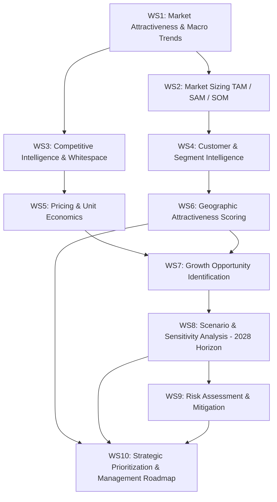
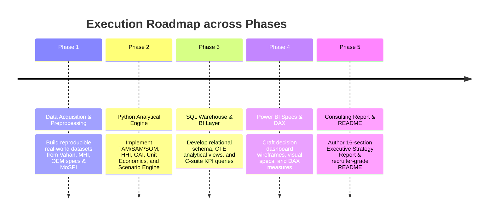

# Project Blueprint & Strategic Business Case: Indian Electric 2-Wheeler Market Strategy

> **Project Title**: Market & Business Strategy Intelligence — Indian Electric 2-Wheeler (e2W) Market Entry & Expansion Strategy  
> **Target Roles**: Business Analyst, Strategy Analyst, Analytics Consultant, Product Analyst, Management Consultant (Bain, BCG, McKinsey, Deloitte, Accenture)  
> **Repository**: `Market-Business-Strategy-Intelligence`  
> **Core Strategic Question**: *"Should the company enter/expand in the Indian electric 2-wheeler market, where should it prioritize expansion, and what competitive, pricing, and growth strategy should it adopt?"*

---

## 1. Refined Business Case

### Context
India is the world’s largest two-wheeler (2W) market, with over 15–20 million units sold annually. Driven by aggressive government decarbonization targets (30% EV penetration by 2030), favorable state-level EV policies, improving battery economics, and rising petrol costs, the **Electric 2-Wheeler (e2W) segment** has emerged as the primary growth vector for Indian automotive electrification.

However, the market is undergoing structural shifts:
1. **Policy Transition & Subsidy Rationalization**: Transition from FAME-II to **PM E-DRIVE** (PM Electric Drive Revolution in Innovative Vehicle Enhancement) marks a shift toward subsidy rationalization and localized manufacturing (PLI). Post-incentive price elasticity and demand sensitivity are critical evaluation factors.
2. **Competitive Shakeout**: Legacy OEMs (TVS Motor, Hero MotoCorp, Bajaj Auto) are aggressively scaling production and expanding retail networks to challenge pure-play EV startups (Ola Electric, Ather Energy).
3. **Infrastructure Bottlenecks & Safety Norms**: Battery thermal management, standards compliance, charging density, and residual value uncertainty remain key friction points for mainstream adoption.

### Business Scenario & Mandate
Assume an automotive entity ("Alpha Motors" — an established ICE 2W manufacturer or international automotive group) is evaluating whether and how to enter or scale in India's electric 2-wheeler market over a **2028 strategic planning horizon** (extending through 2030).

Management requires a data-driven, defensible strategic roadmap answering 10 core questions:
1. How attractive is the Indian electric 2-wheeler market structurally?
2. How large is the addressable market opportunity (TAM / SAM / SOM)?
3. What is the historical trajectory and projected growth rate (CAGR)?
4. Which competitors currently hold dominant market positions, and where is competitive whitespace?
5. Which customer and use-case segments present the most profitable opportunities?
6. What pricing and product-positioning sweet spots exist under PM E-DRIVE and post-subsidy environments?
7. Which Indian states and regions should be prioritized for rollout based on objective econometric data?
8. What commercial, technological, and regulatory risks exist, and how can they be mitigated?
9. Which growth strategy (National Rollout vs. Regional Focus vs. B2B Fleet vs. Mass Commuter Value) yields the highest risk-adjusted return?
10. What immediate, actionable next steps should executive management execute?

---

## 2. Strategic Hypotheses (To Be Tested against Data)

> **Core Strategic Hypothesis**:  
> *"The Indian e2W market is transitioning from subsidy-dependent early adoption to utility-driven mass adoption. A mid-market commuter proposition may offer an attractive balance between affordability, range, contribution economics, and addressable demand. The analysis will test alternative price, battery, range, and positioning scenarios before making a recommendation."*

> **Sub-Hypotheses for Empirical Validation**:
> 1. **Market Attractiveness**: Indian e2W market growth is structurally durable beyond government subsidies.
> 2. **Geographic Focus**: Regional expansion into high-scoring states will yield superior unit economics compared to a capital-intensive broad national rollout.
> 3. **Geographic Selection**: Priority states will be selected by calculating the Geographic Attractiveness Index (GAI) across all available states/UTs; the final number of priority states (e.g., 5, 6, 8, 10) will be an analytical output of the model.
> 4. **Product Positioning**: A specific price, battery capacity (kWh), and real-world range combination will emerge from competitive whitespace and contribution margin modeling as the optimal entry product.
> 5. **2028 Strategic Horizon**: Potential market share, revenue, and contribution margin outcomes through the 2028 strategic planning horizon will be evaluated using rigorous scenario analysis (Conservative, Base, Upside).

---

## 3. Exact Scope

| Dimension | In-Scope | Out-of-Scope |
| :--- | :--- | :--- |
| **Geographic Scope** | All 28 States & 8 Union Territories in India for which reliable data is available; data-driven GAI ranking. | International markets outside India. |
| **Vehicle Category** | High-Speed Electric 2-Wheelers (L2/L3 category, speed > 25 km/h, requiring Vahan registration). | Low-speed non-registered e-bikes (< 25 km/h), Electric 3-Wheelers, Electric 4-Wheelers. |
| **Time Horizon** | Historical Analysis: CY2020 – CY2025/2026. Strategic Planning Horizon: 2028 (with long-term projections to 2030). | Pre-2020 legacy historical trends. |
| **Market Segments** | B2C Personal Commuter, B2C Premium/Performance, B2B Last-Mile Delivery/Commercial Fleets. | Off-road / Racing niche vehicles. |
| **Policy Scope** | PM E-DRIVE, historical FAME-II context, post-subsidy demand sensitivity analysis. | Fabricated future subsidy schemes. |
| **Analytical Scope** | Market Sizing, Growth, Competitor Share, Pricing, State Scoring, Unit Economics, Scenario Modeling, Strategic Risk. | Full supply-chain manufacturing plant layout design, deep battery chemistry molecular research. |

---

## 4. Exact Analytical Questions

### Workstream 1: Market Attractiveness & Macro Trends
- What is the total size and historical CAGR of e2W sales/registrations in India (2020–2025/2026)?
- How has e2W penetration rate (% of total 2W sales) evolved over time across national and state levels?
- What structural tailwinds (fuel price parity, urban commute trends, policy mandates) and headwinds (subsidy reductions under PM E-DRIVE, safety standards) govern market growth?

### Workstream 2: Market Sizing (TAM / SAM / SOM)
- What is the overall Total Addressable Market (TAM) in volume (units) and value (INR Crores) by 2028 and 2030?
- What portion represents the Serviceable Addressable Market (SAM) based on target price bands and high-penetration geographies?
- What realistic Serviceable Obtainable Market (SOM) can an expanding player capture under Conservative, Base, and Upside scenarios through 2028?

### Workstream 3: Competitive Intelligence & Whitespace
- How concentrated is the Indian e2W market (Herfindahl-Hirschman Index - HHI)?
- How have market shares shifted between pure-play EV startups (Ola, Ather) and legacy OEMs (TVS, Hero MotoCorp, Bajaj)?
- What product/pricing whitespace exists across ex-showroom price, battery capacity (kWh), and real-world range (km)?

### Workstream 4: Customer & Segment Intelligence
- How do customer needs differ between urban personal commuters, tier-2/3 daily riders, and B2B delivery fleets?
- What are the primary barriers to consumer adoption (range anxiety, upfront price post-PM E-DRIVE, charging accessibility, resale value)?
- Which customer segment yields the best balance of volume potential and pricing power?

### Workstream 5: Pricing, Commercial & Unit Economics Analysis
- How are competitor products priced across battery capacities (kWh) and real-world ranges (km)?
- What is the Price-to-Range ratio (₹/km) across the market?
- Under realistic bill-of-materials (BOM) assumptions, what is the estimated unit contribution margin post-incentive? What is the break-even unit volume?

### Workstream 6: Geographic Opportunity & State Scoring
- How do all available Indian states and UTs rank on the Geographic Attractiveness Index (GAI)?
- What is the analytical recommendation for the optimal number of priority target states (Tier 1 vs Tier 2)?
- Where should physical retail, charging, and service footprints be deployed first?

### Workstream 7: Strategic Growth Opportunities
- What are the top high-conviction growth vectors (e.g., tier-2/3 expansion, B2B fleet leasing, battery subscription, value-segment launch)?
- How do these opportunities rank in terms of revenue potential vs execution risk?

### Workstream 8: Scenario & Sensitivity Analysis (2028 Horizon)
- How do market adoption, revenue, and contribution outcomes respond across Conservative, Base, and Upside scenarios through 2028?
- What is the impact of key sensitivity factors: PM E-DRIVE policy/incentive rationalization, lithium-ion cell price fluctuations ($/kWh), and petrol price changes?

### Workstream 9: Risk Analysis
- What are the top macro, competitive, operational, policy, and technological risks?
- What is the expected loss/impact of each risk, and what mitigation playbooks should management prepare?

### Workstream 10: Strategic Prioritization & Recommendation
- How do strategic entry options compare on a multi-criteria decision matrix?
- What is the evidence-driven recommendation and execution roadmap through 2028?

---

## 5. Analytical Workstreams Overview

---

## 6. KPI Dictionary

| Metric Name | Category | Definition / Formula | Unit | Classification |
| :--- | :--- | :--- | :--- | :--- |
| **Total 2W Market Volume** | Market Sizing | Annual total sales of ICE + Electric 2-Wheelers in India | Units | Publicly Observed |
| **e2W Annual Registrations** | Market Growth | Total electric 2W registered on Vahan per calendar year | Units | Publicly Observed |
| **e2W Penetration Rate** | Adoption | `(Annual e2W Registrations / Total Annual 2W Volume) * 100` | % | Calculated Metric |
| **Market Growth Rate (YoY)** | Market Growth | `((e2W_Volume_t - e2W_Volume_t-1) / e2W_Volume_t-1) * 100` | % | Calculated Metric |
| **CAGR (2020-2025 / 2025-2028)**| Market Growth | `((Volume_End / Volume_Start)^(1/n) - 1) * 100` | % | Calculated Metric |
| **TAM (Total Addressable Market)**| Market Sizing | Total potential e2W volume in India if 100% 2W sales transition to EV | INR Cr / Units | Calculated Metric |
| **SAM (Serviceable Addressable Market)**| Market Sizing | Priority state volume * Addressable price-segment share | INR Cr / Units | Derived Estimate |
| **SOM (Serviceable Obtainable Market)**| Market Sizing | SAM * Targeted realistic market share | INR Cr / Units | Scenario Model |
| **OEM Market Share** | Competition | `(OEM Annual e2W Registrations / Total Annual e2W Registrations) * 100`| % | Calculated Metric |
| **Market Concentration (HHI)** | Competition | `Sum of (OEM_Market_Share_i)^2` for all OEMs | Index (0-10,000)| Calculated Metric |
| **Effective Purchase Price** | Commercial | Ex-showroom Price + Registration/Taxes - PM E-DRIVE Subsidy | INR (₹) | Calculated Metric |
| **Price-to-Range Ratio** | Commercial | `Ex-showroom Price (₹) / IDC Certified Range (km)` | ₹ / km | Calculated Metric |
| **Price-to-Battery Ratio** | Commercial | `Ex-showroom Price (₹) / Battery Capacity (kWh)` | ₹ / kWh | Calculated Metric |
| **Total Cost of Ownership (TCO)**| Commercial | `Purchase Price + (5-Yr Running Cost) + Maintenance - Resale` | ₹ / km | Derived Estimate |
| **Unit Contribution Margin** | Unit Economics| `Net Realized Revenue per Unit - Estimated Variable BOM & Mfg Cost`| ₹ / Unit & % | Derived Estimate |
| **Break-Even Volume** | Unit Economics| `Annual Fixed Expenses / Unit Contribution Margin` | Units | Derived Estimate |
| **Geographic Attractiveness Score**| Geography | Multi-factor weighted index of registrations, growth, NSDP, charging, policy | Score (0-100) | Calculated Metric |
| **Strategic Priority Score** | Strategy | Weighted rating across Market Attractiveness, Fit, Return, Risk | Score (0-100) | Scenario Value |

---

## 7. Data Requirements & Candidate Real-World Data Sources

All datasets will be compiled from verifiable, official public records and company disclosures:

| Data Source | Specific Datasets / Reports | Primary Analytical Purpose | Availability |
| :--- | :--- | :--- | :--- |
| **Vahan Dashboard** (MoRTH) | Monthly state-wise, manufacturer-wise EV vehicle registration counts (2020–2026) | Market size, growth trajectory, state-level volume, OEM market share, market concentration (HHI). | **High** (Public Portal / Gazette Records) |
| **Ministry of Heavy Industries (MHI)** | PM E-DRIVE notifications, FAME-II outlay releases, incentive per kWh cap history | Incentive structures, subsidy rationalization impact, policy timelines. | **High** (Official Gazette Notifications) |
| **NITI Aayog & e-AMRIT** | Reports on EV Financing, Charging Infrastructure, State Policy Scorecards | State policy incentive benchmarks, charging infrastructure distribution. | **High** (Official Publications) |
| **SIAM (Society of Indian Automobile Manufacturers)**| Annual Industry Statistics (Total 2W Domestic Sales: Motorcycles + Scooters) | Total addressable 2W baseline volume to calculate EV penetration rates. | **High** (Official Press Releases) |
| **Company Filings & DRHPs** | Ola Electric DRHP (2024), TVS Motor Annual Reports, Hero MotoCorp & Bajaj Auto Investor Presentations | OEM financial metrics, gross margin benchmarks, product portfolio specs, dealership counts. | **High** (SEBI / NSE / BSE Filings) |
| **OEM Official Portfolios** | Web specs for Ola S1 series, TVS iQube, Ather (450X/Rizta), Bajaj Chetak, Hero VIDA V1, Greaves Ampere, etc. | Product specs (battery kWh, certified range, motor power, charging time, ex-showroom price). | **High** (Public Product Catalogs) |
| **RBI / MoSPI Economic Data** | State-wise Per Capita Net State Domestic Product (NSDP), urban population | Wealth/affordability proxy for Geographic Attractiveness Index. | **High** (MoSPI / RBI Statistics) |

---

## 8. Geographic Attractiveness Index (GAI) Framework

To prioritize expansion across Indian states, all available 28 states and UTs will be scored on the following multi-factor index:

$$\text{GAI}_{\text{State}} = \sum_{k=1}^{6} (w_k \times S_{k, \text{State}})$$

| Evaluation Dimension | Weight ($w_k$) | Indicator / Variable | Source |
| :--- | :--- | :--- | :--- |
| **Market Scale** | 25% | Absolute e2W Registration Volume | Vahan Dashboard |
| **Growth Velocity** | 20% | YoY % Increase in e2W Registrations | Vahan Dashboard |
| **EV Penetration Rate** | 20% | e2W Registrations as % of Total 2W Registrations | Vahan / SIAM |
| **Purchasing Power** | 15% | Per Capita Net State Domestic Product (NSDP) | RBI / MoSPI |
| **Policy Environment** | 10% | State EV Policy score (Road tax waiver, capital subsidy) | NITI Aayog e-AMRIT |
| **Infra Readiness** | 10% | Public Charging Station Density | BEE / NITI Aayog |

Each indicator $S_k$ is normalized on a scale of **0 to 100** using Min-Max scaling:
$$S_{\text{normalized}} = \frac{X - X_{\min}}{X_{\max} - X_{\min}} \times 100$$

*Note*: The number of priority states (e.g., 5, 6, 8, 10) will be determined strictly by the empirical distribution of GAI scores, not pre-selected.

---

## 9. Scenario & Sensitivity Framework (2028 Strategic Horizon)

Three macro scenarios will evaluate potential market, revenue, and contribution outcomes through 2028:

| Driver / Parameter | Conservative Scenario | Base Case Scenario | Upside Scenario |
| :--- | :--- | :--- | :--- |
| **Government Policy / Incentive** | PM E-DRIVE subsidy expires early; post-subsidy price shock | PM E-DRIVE follows scheduled tapering; road tax waivers maintained | PM E-DRIVE extended; strong commercial fleet EV mandates |
| **Battery Pack Cost ($/kWh)** | Stagnant at $115/kWh due to raw material bottlenecks | Declines to $85/kWh by 2028 following global scale | Declines to $65/kWh by 2028 accelerated by PLI cell manufacturing |
| **Petrol Price Trend** | Flattens at ₹95/L | Increases 4% p.a. reaching ₹115/L by 2028 | Escalates to ₹135/L |
| **Strategic Outcome** | Evaluated in model | Evaluated in model | Evaluated in model |

---

## 10. Execution Roadmap across Phases

---

> **Status**: Blueprint updated with all four strategic corrections. Ready for Phase 1 Data Acquisition.
